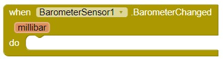

# **Barometer Extension**

For help on how to use an App Inventor extension, please see this [extensions guide](http://ai2.appinventor.mit.edu/reference/other/extensions.html).

## Download
You can download the barometer extension [here](https://gldias.github.io/extensions/Barometer/barometer.aix).

## Description
A barometer is a device that is used to measure atmospheric pressure. Usually, barometers are used in weather forecasting, measuring pressure in "millibars," which is equivalent to 100 pascals (the standard unit of pressure). However, since atmospheric pressure changes depending on the distance from sea level, a barometer can also be used to measure altitude.

This extension makes use of your device's pressure sensor to give you the ability to use barometric data within you App Inventor application. This data is returned in millibars and can be displayed, or used, however you would like.

This requires a device with a pressure sensor.

## Properties

Indicates whether the sensor is available. Some devices may not have a pressure sensor, and therefore cannot use this barometer extension.

Indicates whether the sensor is enabled.

Sets the sensor's `Enabled` flag to the provided boolean value (true or false). This can be used to turn the barometer on and off within the app.

Gets the pressure level data in millibars.

## Events

This event is triggered when the atmospheric pressure changes. For continuous reading, this block would be used to encompass any additional logic that requires the barometer.

## Example App

You can use this [example App Inventor application](https://gldias.github.io/extensions/Barometer/BarometerDemo.aia) to see the barometer extension in action.

## Developer Documentation
More in-depth information for developers can be found [here](https://gldias.github.io/extensions/Barometer/barometer_devel).

Copyright 2019 George Colgrove IV, Guilherme Dias, Nathan Oesterle, Ryan Connors
