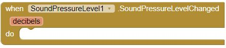

# **Sound Pressure Level Extension**

For help on how to use an App Inventor extension, please see this [extensions guide](http://ai2.appinventor.mit.edu/reference/other/extensions.html).

## Download
You can download the sound pressure level extension [here](https://gldias.github.io/extensions/SoundPressureLevel/SoundPressureLevel.aix).

## Description
This extension measures the sound pressure level and returns the data to your phone to be displayed however you would like. This data is shown in decibels, which is the standard unit used to measure the intensity of a sound. With this data you can build applications that measure and display sound around the device, or even to use sound as a way to control some other component of the application!

This extension requires permission to record audio in order to be able listen to the noise of the surrounding environment. This permission can be granted while running or before starting the application that includes the extension. To ask for permission while running, include an `AskForPermissionPermissionName` block from the screen component, and request the "RECORD_AUIO" permission.

## Properties

Indicates whether or not there is a microphone available to measure sound pressure.

Indicates whether or not the microphone is measuring sound pressure.

Sets the sensor's `Enabled` flag to the provided boolean value (true or false). This can be used to stop or restart measurements.

Gets the sound pressure level data in decibels.

## Events

This event is triggered when the sound level changes. For continuous reading, this block would be used to encompass any additional logic that requires continuous sound measurements.
## Example App

You can use this [example App Inventor application](https://gldias.github.io/extensions/SoundPressureLevel/SPL.aia) to see the sound pressure level extension in action.
