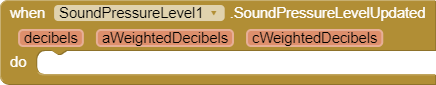

# **Sound Pressure Level Extension**

For help on how to use an App Inventor extension, please see this [extensions guide](http://ai2.appinventor.mit.edu/reference/other/extensions.html).

## Download
You can download the sound pressure level extension [here](https://gldias.github.io/extensions/SoundPressureLevel/SoundPressureLevel.aix).

## Description
This extension measures the sound pressure level and returns the data to your phone to be displayed however you would like. This data is shown in decibels, which is the standard unit used to measure the intensity of a sound. 
There are currently three different measurements reported, which include unweighted decibels (dB), [A-Weighted decibels (dBA)](https://en.wikipedia.org/wiki/A-weighting), and [C-Weighted decibels (dBC)](https://en.wikipedia.org/wiki/A-weighting#C). 
With this data you can build applications that measure and display sound around the device, or even to use sound as a way to control some other component of the application!

Notes:

There are some accuracy issues across devices. 
Different devices will have different microphones with different sensitivity levels. 
This means different devices will hear sounds a little differently, causing measurements to differ.

This extension requires permission to record audio in order to be able listen to the noise of the surrounding environment. This permission can be granted while running or before starting the application that includes the extension. To ask for permission while running, include an `AskForPermission` block from the screen component, and request the "RECORD_AUIO" permission by passing that text to the `permissionName` parameter.

## Properties

Indicates whether or not there is a microphone available to measure sound pressure.

Indicates whether or not the microphone is measuring sound pressure.

Sets the sensor's `Enabled` flag to `true` to turn the extension on and `false` to turn the extension off.

Gets the sound pressure level data in decibels (dB). The measurement reported by this call is unweighted.

Sets the listening interval in milliseconds for how fast should the SPL return a reading.

Gets the listening interval in milliseconds.

## Events

This event is triggered when the sound pressure level is updated. 
This event gives access to the sound intensity over the last `ListenIntervalMilliseconds` in decibels (dB), A-Weighted decibels (dBA), C-Weighted decibels (dBC).

## Example App

You can use this [example App Inventor application](https://gldias.github.io/extensions/SoundPressureLevel/SPL.aia) to see the sound pressure level extension in action.
